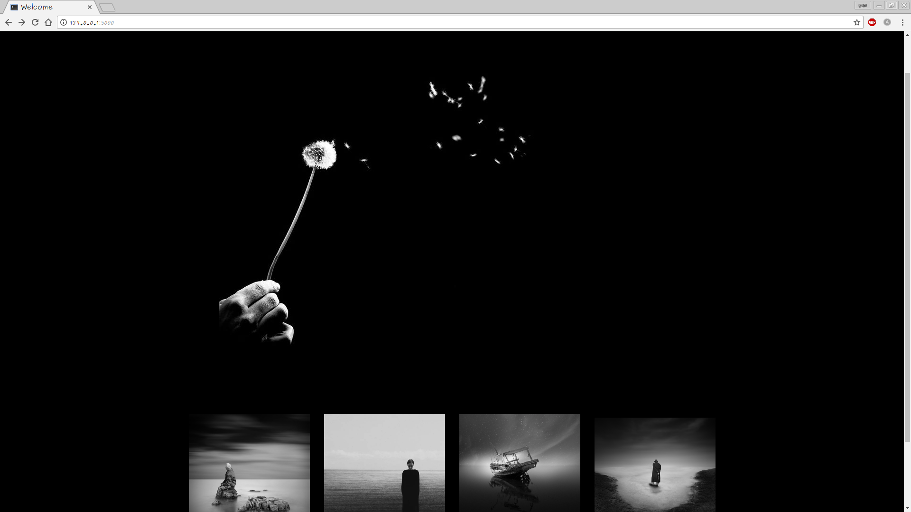

## TheMIn

## Author

Sam Ngigi

# DESCRIPTION

This is an app that allows users to view,submit & comment on blogs based on categories

#### TheMIn Categories
* People
* Nature
* Architecture

#### User Stories

* A users can see blog photos that other people have posted
* A user can comment on different blogs and leave feedback
* A user can delete a comment
* A user can submit a blog photography in any category
* A user can sign up and sign in and logout

## Prerequisites
* Python3.6

## Installation steps
* $ git clone https://github.com/SamNgigi/Pitch-Ip/edit/master/README.md
* $ cd One-Minute-Pitch
* $ source virtual/bin/activate
* Inside the manage.py module change the config_name parameter from 'production' to 'development' ie app = create_app('production') should be app = create_app('development')
* $ ./start.sh

## Credits

#### Moringa School, StackOverflow.com ,mc7.
- Beatrice Mburu

# Technologies Used

#### This project uses major technologies which are :
* HTML5
* CSS
* Bootstrap4
* Python3.6
* flask

### Known bugs, support and Contacts

- Uploading photos is still in development.
- Architecture category not working properly on deployed site.
- Comments not appending to the relevant blog post. It displays on all.

Note- Always begin from the back-end.

Application is still in development phase and still being updated. In case You have any issues using this code please do no hesitate to get in touch with me through sam.t.ngigi@gmail.com or leave a comment here on github.

# License

* MIT License

Copyright (c) 2017 Sam Ngigi

Permission is hereby granted, free of charge, to any person obtaining a copy
of this software and associated documentation files (the "Software"), to deal
in the Software without restriction, including without limitation the rights
to use, copy, modify, merge, publish, distribute, sublicense, and/or sell
copies of the Software, and to permit persons to whom the Software is
furnished to do so, subject to the following conditions:

The above copyright notice and this permission notice shall be included in all
copies or substantial portions of the Software.

THE SOFTWARE IS PROVIDED "AS IS", WITHOUT WARRANTY OF ANY KIND, EXPRESS OR
IMPLIED, INCLUDING BUT NOT LIMITED TO THE WARRANTIES OF MERCHANTABILITY,
FITNESS FOR A PARTICULAR PURPOSE AND NONINFRINGEMENT. IN NO EVENT SHALL THE
AUTHORS OR COPYRIGHT HOLDERS BE LIABLE FOR ANY CLAIM, DAMAGES OR OTHER
LIABILITY, WHETHER IN AN ACTION OF CONTRACT, TORT OR OTHERWISE, ARISING FROM,
OUT OF OR IN CONNECTION WITH THE SOFTWARE OR THE USE OR OTHER DEALINGS IN THE
SOFTWARE.*

Copyright (c) 2017 ** [Sam Ngigi]**
